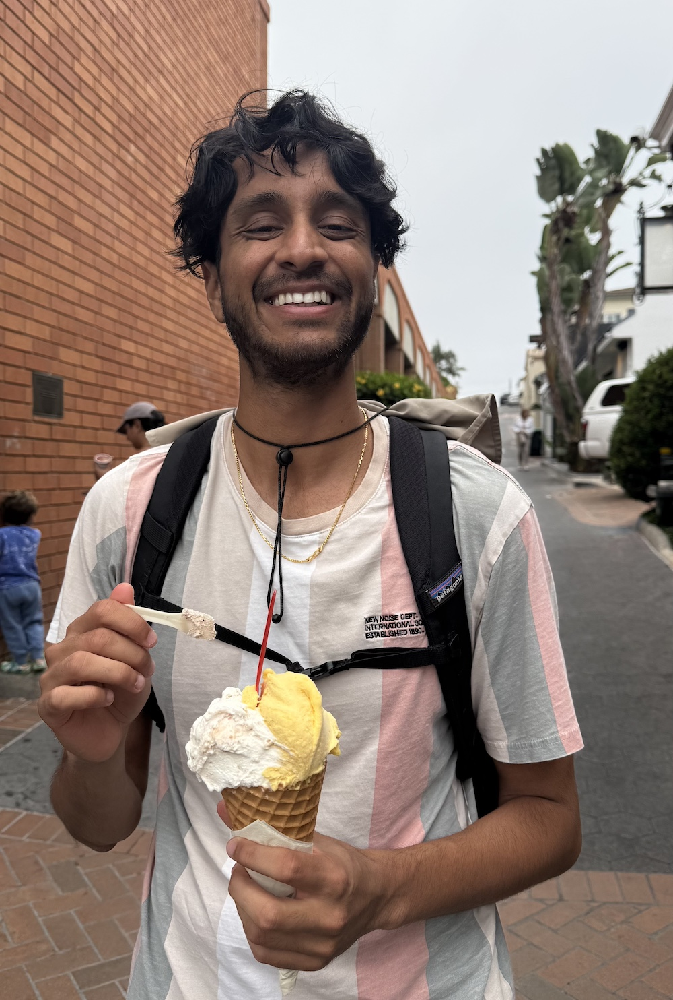

  

    
Welcome to my website! I am a fourth-year PhD student in the Computer Vision and Robotics Laboratory at the University of Illinois at Urbana-Champaign, advised by Prof. <a href="https://vision.ai.illinois.edu/narendra-ahuja/" target="_blank" rel="noopener noreferrer">Narendra Ahuja</a>.

    
I want to understand how and why AI models (for any modality) fail. I believe the key to getting there is by making sense of a model's intermediate representations. I just spent a summer at IBM, under the mentorship of <a href="https://saurabhjha.one/" target="_blank" rel="noopener noreferrer">Saurabh Jha</a>, where I worked on world models for decision-making and planning.

    
I obtained my B.S. from UCSD, where I did research with Prof. <a href="https://sites.google.com/view/ucsdvpl/home?authuser=0" target="_blank" rel="noopener noreferrer">Truong Nguyen</a> and Prof. <a href="https://jacobsschool.ucsd.edu/node/3287" target="_blank" rel="noopener noreferrer">Pamela Cosman</a>.

    

      

        <a href="mailto:{{ site.email }}">Email</a> / 
        <a href="https://www.linkedin.com/in/{{ site.linkedin_username }}" target="_blank">LinkedIn</a> / 
        <a href="https://github.com/{{ site.github_username }}" target="_blank">GitHub</a> / 
        <a href="https://scholar.google.com/citations?user={{ site.google_scholar }}" target="_blank">Scholar</a> / 
        <a href="https://www.youtube.com/channel/{{ site.youtube_channel }}" target="_blank">YouTube</a>
      

    

  

  

    
  

  <h2>Recent News</h2>



  <h2>Research Highlights</h2>
  Selected



<a href="{{ '/research/' | relative_url }}">View all research &rarr;</a>
